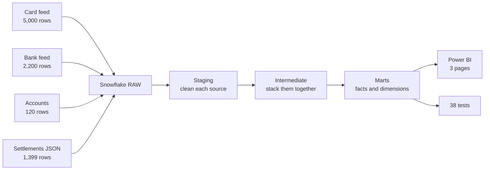

# Payments Data Pipeline

Snowflake · dbt · Power BI

[](https://github.com/kunalpatil3008/payments-data-pipeline/actions/workflows/dbt.yml)

Two systems send the same payments in different formats. This loads both, cleans them, tests them, and reports on them.

Eight things were wrong with the data. Six of them loaded without any error at all.


## The problem

A payments team gets two files every day.

The card machine provider sends one. UK dates, currency written sometimes as `GBP` and sometimes as `gbp`, and now and then the same transaction twice.

The bank sends the other. ISO dates, different column names, and **amounts in pence, not pounds**.

Nothing in either file is marked as wrong. Both load fine. But report on them as they are and one side comes out a hundred times too big, while rows quietly go missing from the other.

The job is to turn both into one table finance can trust, and to be able to prove it is right rather than hope.

## How it works



Four files in, one star schema out, in four steps.

**Raw.** Everything lands exactly as it arrived. Nothing cleaned, nothing edited. If someone questions a number next month, this is what proves what the source actually sent.

**Staging.** One model per file. Trim the spaces off account IDs, force currency to upper case, divide the bank amounts by 100, cast the dates properly. Small jobs, easy to check.

**Intermediate.** Both cleaned sources get turned into the same shape and stacked. This is the only place that knows the two feeds are different.

**Marts.** The tables people actually use. Facts for the events, dimensions for the things those events are about.

## What is in the warehouse

11 models:

| Layer | Models |
|---|---|
| Staging | `stg_card_payments`, `stg_bank_payments`, `stg_accounts`, `stg_settlements` |
| Intermediate | `int_payments_unioned` |
| Marts | `fct_payments`, `fct_settlements`, `fct_settlement_reasons`, `fct_data_quality_log`, `dim_accounts`, `dim_dates` |

38 tests. Most are the standard ones, `unique`, `not_null`, `relationships`, `accepted_values`. Two I wrote by hand:

- the row count after the join has to match the row count before it
- the fact table has to hold the same number of rows the sources sent

Last run: **47 pass, 1 warn, 0 errors.**

## What it caught

| What was wrong | Rows | What I did | Why |
|---|---|---|---|
| Same transaction sent twice | 18 | Removed, kept the first | Duplicates inflate money totals on every join |
| Currency as `GBP` and `gbp` | 845 | Forced to upper case | A GROUP BY splits one currency into two |
| Account IDs with trailing spaces | 30 | Trimmed in staging | Invisible padding, so rows silently fail to match |
| Account that does not exist | 25 | Kept, labelled UNKNOWN | Real money. Dropping it makes the answer quietly incomplete |
| Payment with no amount | 53 | Kept, left out of money totals | A missing amount is not an amount of nothing |
| Marked settled, never reconciled | 123 (£69,905) | Flagged and raised | A field that disagrees with itself cannot be trusted |
| Dated outside the stated quarter | 226 | Still investigating | Either a source error or the file covers more than it claims |
| **Bank amounts in pence** | all 2,200 | Divided by 100 | Nothing catches this. It loads fine and is wrong by 100x |

Two of those are worth pointing at.

**The trailing spaces.** `"ACC001 "` and `"ACC001"` are different strings. The join just does not match. No error is raised. Thirty payments disappear from a report that otherwise looks completely normal.

**The pence.** No test can find this one. Both columns hold perfectly valid numbers. The only thing that catches it is reading the spec and noticing that one system counts in pence. Left alone it overstates the bank feed a hundred times over.

Which is the point of the whole project:

> A file loading successfully only proves it was readable. It says nothing about whether the data is right.

## Fix what is wrong, keep what is incomplete

Every problem above got one of two treatments, and the choice was deliberate.

If the data is **wrong**, fix it. Duplicates, spaces, mixed case, pence. There is a correct value and the pipeline produces it.

If the data is **incomplete**, keep it and label it. Missing amounts, unknown accounts. There is no correct value to guess at. Deleting those rows makes the report look tidy and the answer wrong, because a payment that happened still happened.

The dashboard shows both, and says which is which.

## The data quality page is built from the data

`fct_data_quality_log` counts every issue straight from the warehouse.

That is on purpose. A hand-typed list of known problems is right on the day you write it and wrong a month later. This one cannot drift, because there is nothing to update.

It proved itself immediately. My typed version said 15 missing amounts. The model said 53, because the typed number only covered the bank feed and the fact table holds both.

## The dashboard

**Who to chase first.** 108 accounts hold the £187,910 that has not reconciled. No single account is the problem, the biggest holds under 3%. Sorted by money stuck, with exposure in pounds-days so a small amount sitting for months does not get missed.


**What we know is wrong.** Most dashboards show numbers and say nothing about whether you should believe them. This page does the opposite. Seven known issues, counted live, each marked fixed, accepted, open or escalated.


## It runs on its own

A GitHub Actions job runs `dbt build` on every push and again every night. If a model breaks or a test fails, the build goes red and an email goes out, instead of a wrong number turning up in a report that nobody questions.

## What is in each folder

| Folder | What is in it |
|---|---|
| `data/` | The four source files, deliberately messy |
| `snowflake/` | The SQL for loading and exploring the raw data |
| `payments_dbt/` | The dbt project. Models, tests, macros |
| `docs/` | Dashboard screenshots |
| `.github/` | The nightly build |

## Running it

```bash
cd payments_dbt
dbt build          # runs every model, then every test
dbt docs generate  # builds the lineage graph
dbt docs serve
```

Snowflake credentials come from environment variables, never from a file in this repo:

```
DBT_SNOWFLAKE_ACCOUNT
DBT_SNOWFLAKE_USER
DBT_SNOWFLAKE_PASSWORD
DBT_SNOWFLAKE_ROLE
DBT_SNOWFLAKE_WAREHOUSE
DBT_SNOWFLAKE_DATABASE
```

## What it does not do yet

Being straight about the edges.

No Airflow. Scheduling is GitHub Actions, which is enough at this size, though an orchestrator is the obvious next step.

No incremental models. Everything rebuilds from scratch. Fine at 7,200 rows, wrong at 7 million.

The defects here are real. The scale is not.

---

Built by Kunal Patil · [LinkedIn](https://www.linkedin.com/in/kunalpatil3008) · [GitHub](https://github.com/kunalpatil3008)
