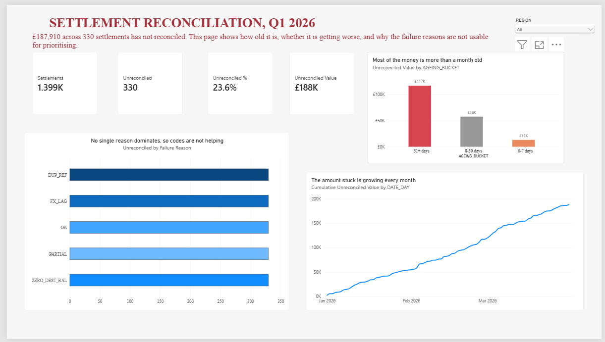
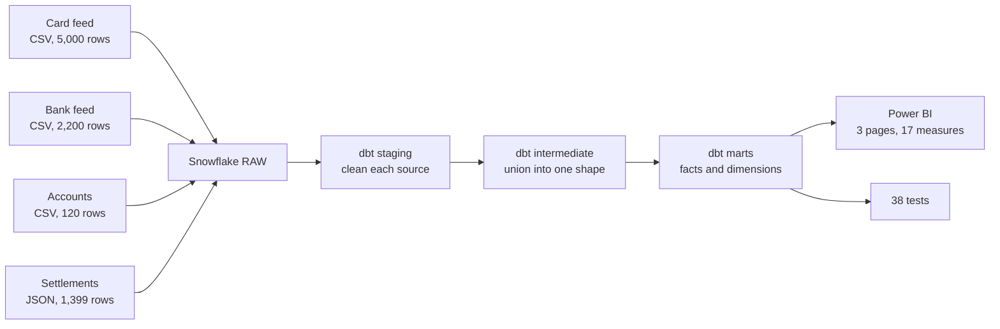
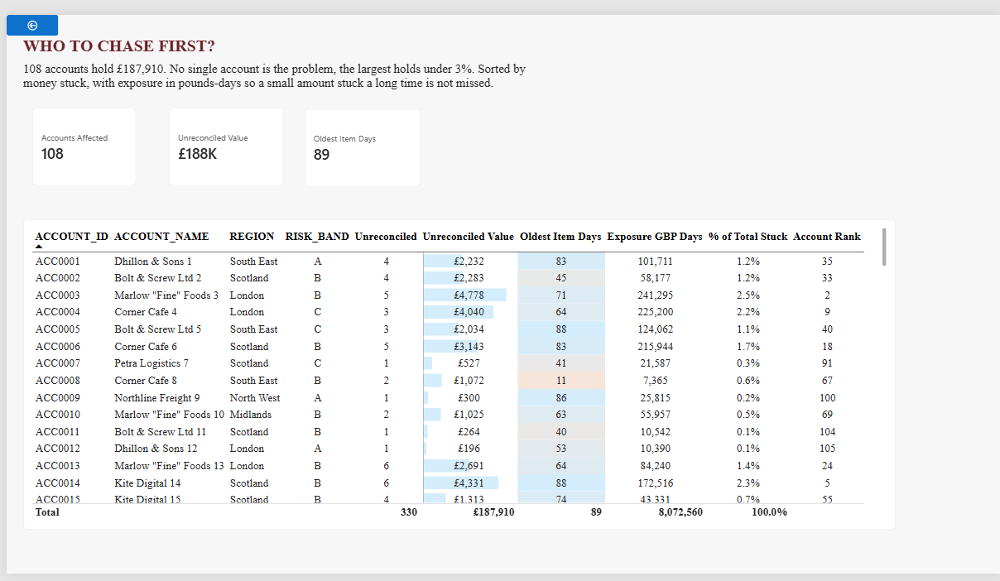
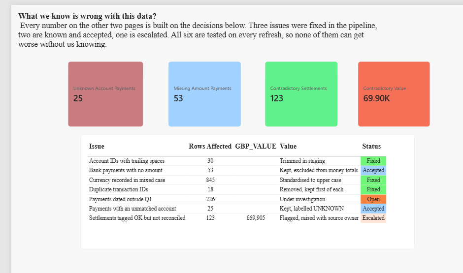

# Payments Data Pipeline

**Snowflake · dbt · SQL · Power BI**

[](https://github.com/kunalpatil3008/payments-data-pipeline/actions/workflows/dbt.yml)

A data engineering project. Two payment systems describe the same transactions in different ways. This pipeline loads both, cleans them, tests them, joins them into one trusted table, and reports on them.

It found eight kinds of broken data. Six of them produced no error message.



---

## The problem

A payments team gets two files every day.

One comes from the card machine provider. It uses UK dates, writes currency sometimes as `GBP` and sometimes as `gbp`, and occasionally sends the same transaction reference twice.

The other comes from the bank. It uses ISO dates, different column names, and **amounts in pence, not pounds.**

Nothing in either file is labelled as wrong. Both load without a single error. And if you report on them as they are, your totals are a hundred times too big on one side and quietly missing rows on the other.

The job of this pipeline is to make those two files into one table that a finance team can actually trust, and to prove that it is right rather than hope.

---

## How it fits together



Four sources in, one star schema out.

---

## The four layers, and why each exists

**RAW.** Everything lands exactly as it arrived. Nothing is cleaned here and nothing is edited. If a number looks wrong three weeks later, this is the layer that proves what the source actually sent.

**STAGING.** One model per source file. Trim the spaces off account IDs, force currency to upper case, divide the bank amounts by 100, cast the dates properly. One file, one job, easy to check.

**INTERMEDIATE.** Both cleaned sources become one shape and get stacked together. This is the only place that knows the two feeds are different.

**MARTS.** The tables people actually use. Facts for the events, dimensions for the things the events are about.

---

## What is in the warehouse

**11 dbt models**

| Layer | Models |
|---|---|
| Staging | `stg_card_payments`, `stg_bank_payments`, `stg_accounts`, `stg_settlements` |
| Intermediate | `int_payments_unioned` |
| Marts | `fct_payments`, `fct_settlements`, `fct_settlement_reasons`, `fct_data_quality_log`, `dim_accounts`, `dim_dates` |

**38 tests.** 36 built in (`unique`, `not_null`, `relationships`, `accepted_values`) and 2 written by hand:

- `assert_union_did_not_fan_out` — the row count after the join must equal the row count before it
- `assert_fact_matches_source` — the fact table must hold the same number of rows the sources sent

Latest run: **47 pass, 1 warn, 0 errors.**

---

## What the pipeline caught

This is the part worth reading.

| What was wrong | Rows | What was done | Why |
|---|---|---|---|
| Same transaction sent twice | 18 | Removed, first kept | Duplicates inflate money totals on every join |
| Currency as `GBP` and `gbp` | 845 | Forced to upper case | A GROUP BY splits one currency into two |
| Account IDs with trailing spaces | 30 | Trimmed in staging | Invisible padding, so rows silently fail to match |
| Account reference does not exist | 25 | Kept, labelled UNKNOWN | Real money. Dropping it makes the answer quietly incomplete |
| Payment sent with no amount | 53 | Kept, left out of money totals | A missing amount is not an amount of nothing |
| Marked settled, never reconciled | 123 (£69,905) | Flagged, raised with the source owner | A field that disagrees with itself cannot be trusted to prioritise work |
| Dated outside the stated quarter | 226 | Under investigation | Either a source error or the file covers more than it claims |
| **Bank amounts in pence** | all 2,200 | Divided by 100 | Nothing catches this. It loads fine and is wrong by 100x |

Two of these are the interesting ones.

**The trailing spaces.** `"ACC001 "` and `"ACC001"` are different strings. The join simply does not match, no error is raised, and thirty payments disappear from a report that otherwise looks completely normal.

**The pence.** No test can find this. Both columns are valid numbers. The only thing that catches it is reading the spec and noticing that one system talks in pence. It would have overstated the bank feed by a factor of one hundred.

The lesson this project is built around:

> **A successful load proves the file was readable. It proves nothing about whether the data is right.**

---

## Wrong gets fixed, incomplete gets kept

Every defect above got one of two treatments, and the choice was deliberate.

If the data is **wrong**, fix it. Duplicates, spaces, mixed case, pence. These have a correct value and the pipeline produces it.

If the data is **incomplete**, keep it and label it. Missing amounts, unknown accounts. These have no correct value to guess. Deleting the row makes the report look clean and quietly makes the answer wrong, because a payment that happened is still a payment that happened.

The report shows both, and says which is which.

---

## The data quality register is a model, not a list

`fct_data_quality_log` counts every defect straight from the data.

That is on purpose. A hand-typed table of known issues is correct on the day you write it and wrong a month later. This one cannot drift, because there is nothing to update.

It proved its worth immediately. A typed version said 15 missing amounts. The live model said 53, because the typed number only counted the bank feed and the fact table holds both.

---

## Power BI

Three pages on a star schema, five relationships, 17 DAX measures.

| Page | What it answers |
|---|---|
| **Overview** | How much money moved, how much is stuck, is it getting better or worse |
| **Worklist** | Which accounts to chase first, ranked by value and by how long they have been sitting |
| **Data quality** | What is known to be wrong with the data, live from `fct_data_quality_log` |

**Worklist.** 108 accounts hold the £187,910 that has not reconciled. No single account is the problem, the largest holds under 3 percent. Sorted by money stuck, with exposure in pounds-days so a small amount stuck for a long time is not missed.



**Data quality.** Most dashboards show numbers and stay silent about how trustworthy they are. This page does the opposite. Every row is counted live from the warehouse, and says whether the issue was fixed, accepted or escalated.



---

## Automation

A GitHub Actions workflow runs `dbt build` on every push and again every night.

If a model breaks or a data test fails, the build turns red and an email goes out. A failure shows up as a failed build instead of as a wrong number that nobody noticed.

---

## Running it yourself

```bash
cd payments_dbt
dbt deps
dbt build          # runs every model, then every test
dbt docs generate  # builds the lineage graph
dbt docs serve
```

Snowflake credentials come from environment variables, never from a file in this repo:

```
DBT_SNOWFLAKE_ACCOUNT
DBT_SNOWFLAKE_USER
DBT_SNOWFLAKE_PASSWORD
DBT_SNOWFLAKE_ROLE
DBT_SNOWFLAKE_WAREHOUSE
DBT_SNOWFLAKE_DATABASE
```

---

## What this does not do yet

Being straight about the edges.

- **No Airflow.** Scheduling is GitHub Actions. At this volume a full orchestrator is not justified, though it is the natural next step.
- **No incremental models.** Everything rebuilds from scratch. Fine at 7,200 rows, wrong at 7 million.
- **Small data.** The defects here are real. The scale is not.

---

## Questions this project answers

1. Walk me through a pipeline you have built
2. What is silent fan out and how did you catch it
3. Tell me about a data quality bug you found
4. How do you handle two sources describing the same thing differently
5. When do you fix bad data and when do you keep it

---

Built by **Kunal Patil** · [LinkedIn](https://www.linkedin.com/in/kunalpatil3008) · [GitHub](https://github.com/kunalpatil3008)
